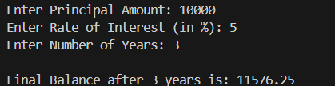

# 🏦 Banking Interest Simulator (C Language)

## 📌 Project Details
- **Project Title:** Banking Interest Simulator  
- **Programming Language:** C  
- **Project Type:** Mini Project  
- **Semester:** First Semester  
- **Course:** C Programming  
- **Tools Used:** VS Code, GCC Compiler, GitHub  

---

## 🎯 Aim of the Project
The aim of this project is to simulate banking interest calculation and compute the **final balance** by adding yearly interest to the principal amount for a given number of years.

---

## 🧾 Project Description
The Banking Interest Simulator is a simple C program that allows the user to:
- Enter the **principal amount**
- Enter the **rate of interest**
- Enter the **number of years**

The program calculates interest **year by year** using a loop and adds it to the balance. After completing all years, it displays the **final balance**.

This project is designed for beginners to understand real-world applications of C programming.

---

## ❓ Why Did I Make This Project
I made this project because:
- It is my **First Semester C mini project**
- To practice **basic C programming concepts**
- To understand how **loops and calculations** work
- To apply programming to a **real-life banking scenario**
- To build my **first academic project for GitHub and portfolio**

---

## 🛠️ How Did I Make This Project
I made this project by following these steps:
1. Studied how banking interest calculation works  
2. Took user input using `scanf()`  
3. Stored the principal amount as the initial balance  
4. Used a `for` loop to calculate interest for each year  
5. Added the interest to the balance every year  
6. Displayed the final balance after all years  
7. Tested the program with different values  

---

## ⚙️ Technologies Used
- **Language:** C  
- **IDE:** VS Code  
- **Compiler:** GCC  
- **Version Control:** Git & GitHub
  
---

## 💡 Project Utility
This project is useful because:
- It helps students understand **banking interest calculations**
- It demonstrates the use of **loops in C**
- It improves **logical thinking**
- It is useful for **academic learning**
- It forms a base for advanced banking applications  

---

## 🚀 Future Scope of the Project
In the future, this project can be extended by:
- Adding **compound interest calculation**
- Displaying **year-wise balance and interest**
- Making the program **menu-driven**
- Adding **file handling** to store user data
- Converting it into a **GUI or web application**

---

## 📸 Screenshots of Output

